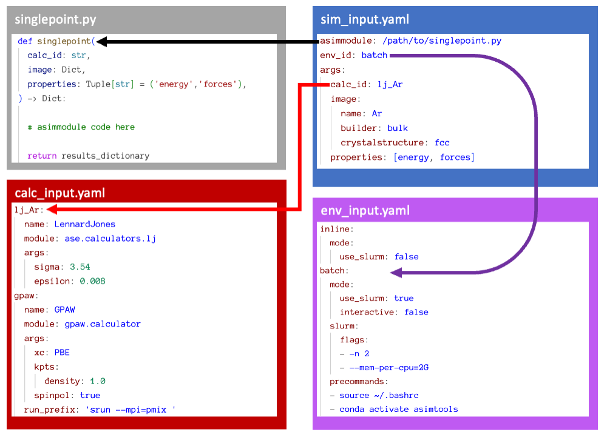

# Summary

Atomic SIMulation Tools (`ASIMTools`) is a lightweight workflow and simulation
manager for reproducible atomistic simulations on Unix-based systems. Within
the framework, simulations can be transferred across computing environments,
DFT codes, interatomic potentials and atomic structures. By using in-built or
user-defined python modules (called asimmodules) and utilities, users can run
simulation protocols and automatically scale them on slurm based clusters or
locally on their console. The core idea is to separate the dependence of the
atomistic potential/calculator, the computing environment and the simulation
protocol thereby allowing the same simulation to be run with different
calculators, atomic structures or on different computers with just a change of
one parameter in an input file after initial setup. This is increasingly
necessary as benchmarking Machine Learning Interatomic Potentials has become a
core part of computational materials science. Input and output files follow a
simple standard format, usually yaml, providing a simple interface that also
acts as a record of the parameters used in a simulation without having to edit
python scripts. The minimal set of requirements means any materials science
codes can be incorporated into an ASIMTools workflow in a unified way.

# Statement of need

Atomic simulations are a key component of modern day materials science in both
academia and industry. However, simulation protocols and workflows used by
researchers are typically difficult to transfer to systems using different
inputs, codes and computing environments. It often involves rewriting entire scripts in
different languages to change from one type of atomistic potential or atomic
structure to another. This leads to poor reproducibility and inefficient
transfer of code from one researcher to the next. In addition, there exists a
zoo of tools and packages for atomic simulation with more being developed every
day [@walsh_open_2024]. There is however no unifying framework that can
encompass all these tools without significant software development effort.
Significant effort should not be necessary because while the source of the
fundamental outputs of atomistic potentials such as energy, forces etc. may
differ, simulation protocols built on these outputs should converge towards the
most accurate and computationally efficient. ASIMTools focuses on this last
aspect by introducing asimmodules which are simply Python functions that act as
simulation protocols which have no dependence on a specific atomistic potential
or computational environment or atomic structure. Through iteration and
community input, these simulation protocols will hopefully converge towards
best practice and ensure reproducibility of simulation results.

`ASIMTools` is for users interested in performing atomistic calculations on
UNIX-like operating systems and/or on slurm-based High Performance Computing
clusters. By defining simulation protocols as "asimmodules", they
can be easily added to the library of provided asimmodules and iterated on.
The flexibility of ASIMTools allows integration of any kind of
simulation tools such as the heavily used Atomic Simulation Environment
[@larsen_atomic_2017] pymatgen [@ong_python_2013], LAMMPS
[@thompson_lammps_2022] etc. with examples provided. With the asimmodules
defined, users only need to provide a set of inputs in the form of yaml files
that define the parameters used for each simulation and are therefore a
concrete record of used parameters. 

# State of the Field
There exist a number of popular workflow tools for atomistic simulations such
as Aiida [@huber_aiida_2020], Fireworks [@jain_fireworks_2015] and many
more. These tools provide frameworks for constructing complex workflows with
different underlying principles. Some managers enforce strict rules that ensure
that data obeys FAIR principles and emphasizes data provenance and
reproducibility. These methods however tend to be fairly large packages with
steep learning curves. ASIMTools provides a simple interface as a starting
point that can transform any code into ASIMTools compatible code by simply
wrapping it in a function that returns a Python dictionary. Any such code can
work in ASIMTools and with a few extra steps, the protocol can be made to
support an arbitrary calculator and input atomic structure.

In some workflow managers, such as Atomic Simulation Recipes
[@gjerding_atomic_2021], once workflows are built, it can often be difficult to
quickly change and iterate over key parameters such as the choice of atomistic
calculator or structure as they are intrinsically built into the code. This is
particularly challenging in an age where machine learning models are becoming
more popular. Workflows involving machine learning interatomic potentials tend
to require the ability to repeat the same calculations on different examples,
using different calculators on different hardware iteratively. This is where
the value of ASIMTools lies in contrast to more established workflows.
ASIMTools is not designed to replace the more powerful workflow managers but
rather to supplement them. This is achieved by providing unified inputs that
can be easily integrated into, for example, Aiida as Python
functions/asimmodules while also being a stand-alone lightweight workflow
manager for simpler cases.

# Usage To-Date

ASIMTools has been used in the benchmarking Machine Learning Interatomic
Potentials [@phuthi_accurate_2024] and creating a workflow for calculation of
vibrational properties of solids calculations [@phuthi_vibrational_2024].

<!-- # Examples
We present two examples of simulation protocols, many more can be found in the
ASIMTools documentation.

## Example 1: Single point calculation of energy and forces
Many atomic simulations involve evaluations of energies, forces, dipoles etc.
of an atomic configuration. In Figure. \autoref{fig:singlepoint} we show how
the `singlepoint` asimmodule, provided in ASIMTools can be used and the input
files needed to run the asimmodule with arbitrary input structure, calculator
in an arbitrary environment.

While requiring four input files for such a simple calculation can seem
cumbersome at first, the benefit of this approach becomes apparent with
repeated use and in high-throughput workflows. The global calc_input.yaml and
env_input.yaml configuration files describe the possible calculators and
environments respectively and are accessible to all simulations. Therefore they
only need to be modified when new environments or calculators are configured,
which is rare. The asimmodule, a python module, forms the heart of the
approach. A large library of asimmodules and corresponding examples are
provided within ASIMTools for standard atomic calculations. Users can also
create their own asimmodules with the only restriction being that they are
python modules with a correspondingly named function that returns a dictionary.
These asimmodules should eventually converge to the most efficient and robust
simulation protocol over time. Finally the sim_input.yaml is the file that is
used on a daily basis to run the simulation and contains the parameters for the
simulation protocol to be performed.

It becomes very simple therefore to take any simulation protocol such as the
singlepoint.py asimmodule and to change the calculator from a cheaper
Lennard-Jones potential or universal force field to a more expensive DFT
calculator defined in calc_input.yaml, useful for testing. Similarly, changing
the specified env_id changes the environment from running the protocol
inline in a console to running it using the slurm scheduler without the need to
write a job script. Just as well, the input image can be provided from any
source e.g. a file, constructed using ASE as in Figure.
\autoref{fig:singlepoint} or downloaded from Materials Project. This modularity
without the need to touch any code or alter the simulation code and potentially
introducing bugs, is useful for benchmarks and comparing parameter choices.

{ width=100% }

## Example 2: Iterating over arguments of a simulation protocol

Given the infrastructure setup for running one simulation protocol like the
singlepoint calculation, ASIMTools makes it straightforward to immediately
scale. Through a set of workflow tools, simulations can be distributed in
parallel across different simulation parameters as shown in the second example.
ASIMTools automatically knows to submit jobs in parallel in slurm where
possible without user intervention. Additionally, simulation protocols can be
chained together if they have dependent results irrespective of whether they
are run in slurm in different environments or in a console without user
Intervention with multiple examples provided. This means that once an
asimmodule is written to perform a single simulation protocol using ASIMTools
principles, it can immediately be run with any defined input structure,
calculator on any computing environment at scale.

Below is an example sim_input.yaml for performing a number of singlepoint
calculations on structures with different lattice constants. Because the
calc_input.yaml, env_input.yaml and asimmodule were already defined before,
they need not be defined again. The `key_sequence` determines the key that will
be distributed with the values in `array_values`. In the example below, the
sequence defines the lattice parameter a that is nested within image that is
itself in args.

```
asimmodule: workflows.sim_array
args:
	key_sequence: [args, image, a]
	array_values: [5.1,5.2,5.3,5.4,5.5]
	template_sim_input:
		asimmodule: singlepoint
		args:
			calc_id: lj_Ar
			image:
				name: Ar
				crystalstructure: fcc
				a: null  # Iterate over this value
``` -->

# Conclusion and Availability
The ASIMTools package is a powerful tool for building and executing atomic
simulation protocols locally and at scale on slurm-based HPC infrastructure.
The code is hosted on a public Github repository
(https://github.com/BattModels/asimtools) with a number of examples.
Asimmodules for common calculations are also implemeted with examples.
Interested users are encouraged to submit issues, contact developers and make
pull requests, particularly for adding new simulation protocols to the library.

# Author Contribution Statement

Conceptualization by Keith Phuthi. Coding and development by Keith Phuthi and
Emil Annevelink. Paper writing by Keith Phuthi. Project management by all.

# Acknowledgements

We acknowledge feedback from Kian Pu, Lance Kavalsky, Hancheng Zhao and Ziqi
Wang.

# References
